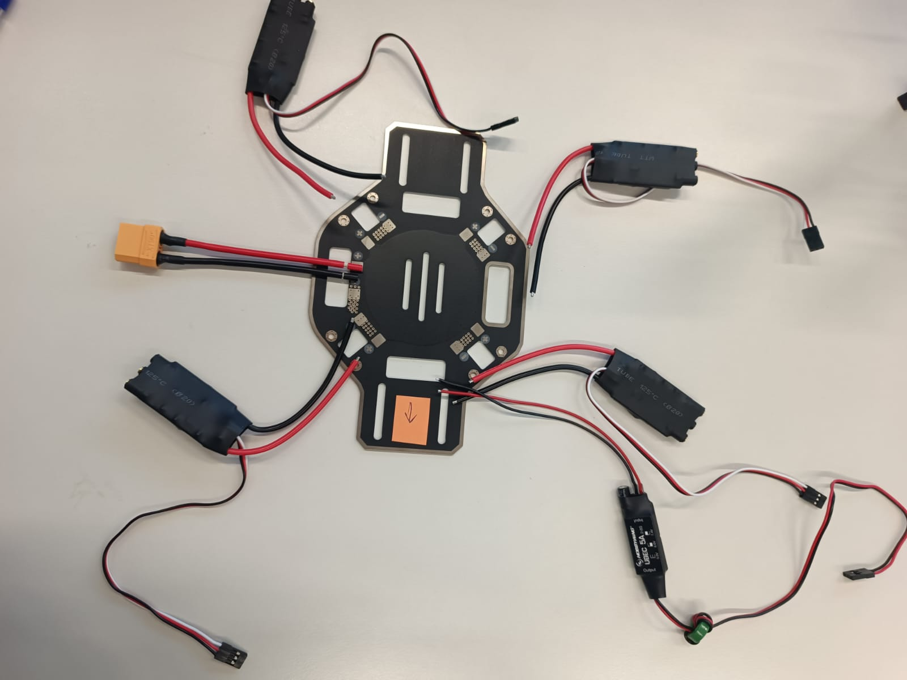
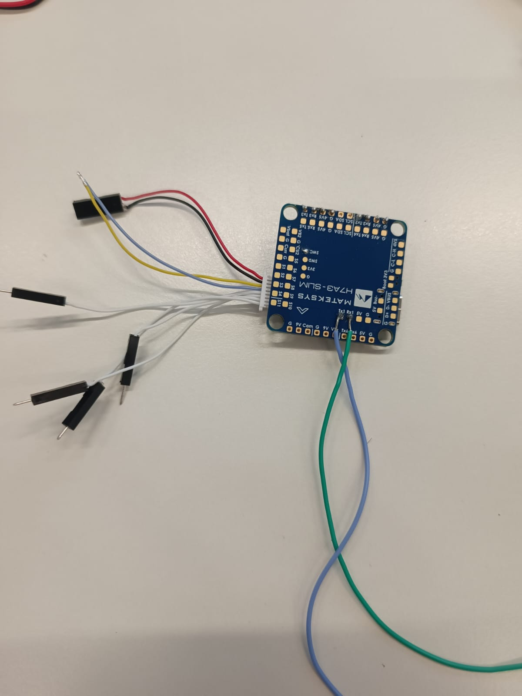
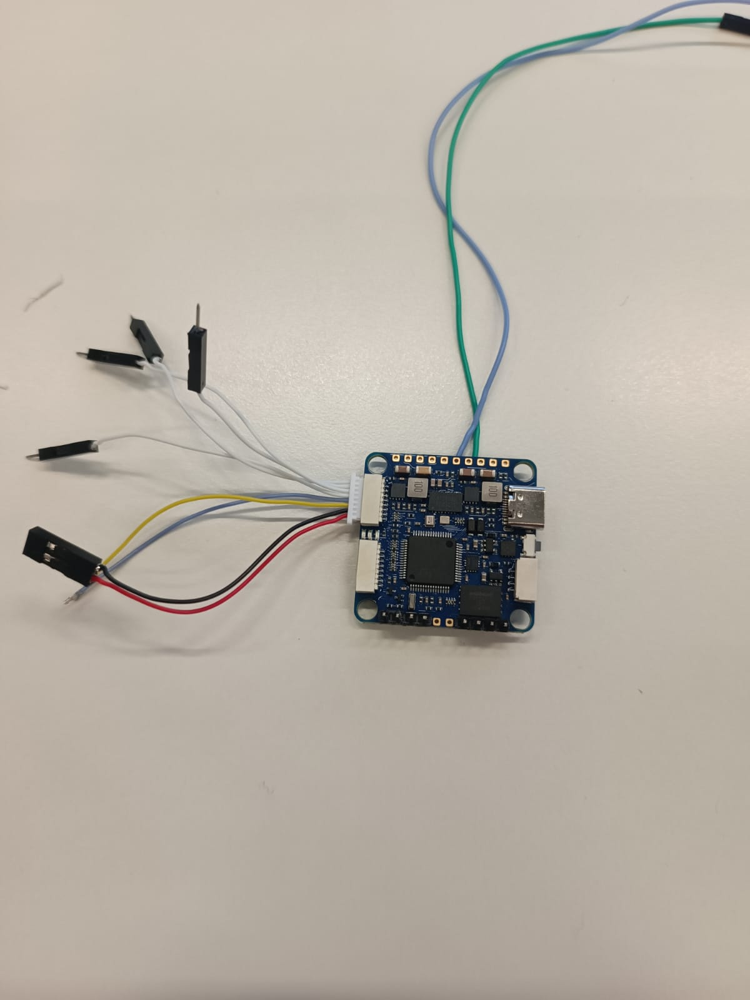

# Expected Assembly

This section outlines what the final hardware assembly should look like once all components have been mounted, wired, and secured to the frame.

## Expected Board Layout

!!! tip "Recommendation"
    We recommend excluding the intermediate XT60 connector and instead making a direct connection from the board to the ESCs. This reduces weight, saves space, and removes a potential point of failure.

## STM32 Flight Controller 

**Front View:**

**Back View:**

