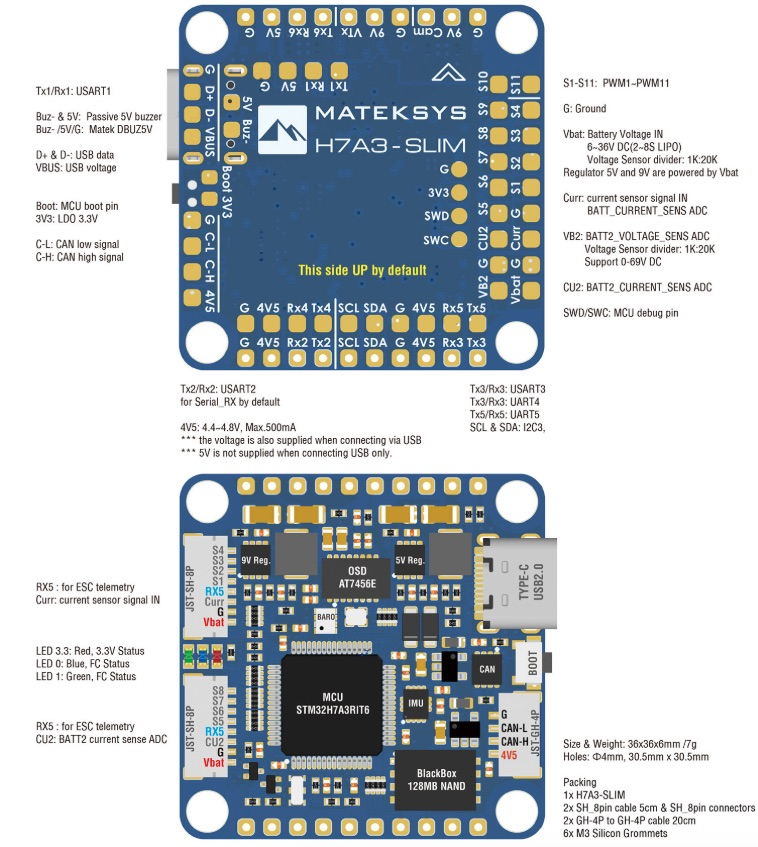

<header>
  # MatekH7A3 &rarr; F450 &mdash; Connection Guide
  
ArduCopter 4.7.0 &middot; Quad X &middot; every pad verified against the Matek silkscreen
     and this board's live parameters

  

    STM32H7A3 &middot; 280 MHz
    ICM-42688P IMU
    SPL06 baro
    2S&ndash;6S input
    11&times; PWM
    6&times; UART
    1&times; I2C
  

</header>

<nav>
  <a href="#1-board-layout">1 · Board</a>
  <a href="#2-power-where-everything-gets-its-volts">2 · Power</a>
  <a href="#3-receiver-compass-and-gps-one-block-of-pads">3 · RX / GPS / compass</a>
  <a href="#4-escs-motors">4 · Motors</a>
  <a href="#5-uart-reference">5 · UARTs</a>
  <a href="#6-bring-up-order">6 · Bring-up</a>
</nav>

<!-- ========== 1 BOARD ========== -->
## 1 &middot; Board layout
  

    
Official Matek photo (cross-check the silkscreen)

    
  

  
Top view, forward arrow up. Pads colour-coded by what connects to them.

  

    
<svg viewBox="0 0 560 560" xmlns="http://www.w3.org/2000/svg" role="img" aria-label="MatekH7A3 pad layout">
<rect x="70" y="70" width="420" height="420" rx="16" fill="#1e4d8c" stroke="#14375f" stroke-width="2"/>
<circle cx="96" cy="96" r="15" fill="var(--card)" stroke="#94a3b8" stroke-width="2"/>
<circle cx="464" cy="96" r="15" fill="var(--card)" stroke="#94a3b8" stroke-width="2"/>
<circle cx="96" cy="464" r="15" fill="var(--card)" stroke="#94a3b8" stroke-width="2"/>
<circle cx="464" cy="464" r="15" fill="var(--card)" stroke="#94a3b8" stroke-width="2"/>
<rect x="44" y="238" width="26" height="76" rx="6" fill="#cbd5e1" stroke="#64748b" stroke-width="2"/>
<text x="30" y="282" font-size="10" fill="var(--muted)" text-anchor="middle" transform="rotate(-90 30 282)">USB-C</text>
<path d="M256 168 l24 -26 l24 26" fill="none" stroke="#fff" stroke-width="7" stroke-linecap="round" stroke-linejoin="round"/>
<text x="280" y="205" font-size="12" fill="#cfe0f5" text-anchor="middle" font-weight="700" letter-spacing="1.5">FORWARD</text>
<text x="280" y="268" font-size="19" fill="#fff" text-anchor="middle" font-weight="700" letter-spacing="1">MATEKSYS</text>
<text x="280" y="292" font-size="15" fill="#cfe0f5" text-anchor="middle" font-weight="600">H7A3-SLIM</text>
<text x="280" y="330" font-size="10" fill="#9db8d8" text-anchor="middle">36 x 36 mm &#183; 30.5 mm M3</text>
<rect x="82.0" y="84" width="26" height="18" rx="4" fill="#64748b" stroke="#ffffff" stroke-opacity=".35"/>
<text x="95.0" y="96.2" font-size="9" fill="#fff" text-anchor="middle" font-weight="700" font-family="ui-monospace,monospace">G</text>
<rect x="123.5" y="84" width="26" height="18" rx="4" fill="#b45309" stroke="#ffffff" stroke-opacity=".35"/>
<text x="136.5" y="96.2" font-size="9" fill="#fff" text-anchor="middle" font-weight="700" font-family="ui-monospace,monospace">5V</text>
<rect x="165.0" y="84" width="26" height="18" rx="4" fill="#64748b" stroke="#ffffff" stroke-opacity=".35"/>
<text x="178.0" y="96.2" font-size="9" fill="#fff" text-anchor="middle" font-weight="700" font-family="ui-monospace,monospace">Rx6</text>
<rect x="206.5" y="84" width="26" height="18" rx="4" fill="#64748b" stroke="#ffffff" stroke-opacity=".35"/>
<text x="219.5" y="96.2" font-size="9" fill="#fff" text-anchor="middle" font-weight="700" font-family="ui-monospace,monospace">Tx6</text>
<rect x="248.0" y="84" width="26" height="18" rx="4" fill="#64748b" stroke="#ffffff" stroke-opacity=".35"/>
<text x="261.0" y="96.2" font-size="9" fill="#fff" text-anchor="middle" font-weight="700" font-family="ui-monospace,monospace">Vtx</text>
<rect x="289.5" y="84" width="26" height="18" rx="4" fill="#b45309" stroke="#ffffff" stroke-opacity=".35"/>
<text x="302.5" y="96.2" font-size="9" fill="#fff" text-anchor="middle" font-weight="700" font-family="ui-monospace,monospace">9V</text>
<rect x="331.0" y="84" width="26" height="18" rx="4" fill="#64748b" stroke="#ffffff" stroke-opacity=".35"/>
<text x="344.0" y="96.2" font-size="9" fill="#fff" text-anchor="middle" font-weight="700" font-family="ui-monospace,monospace">G</text>
<rect x="372.5" y="84" width="26" height="18" rx="4" fill="#64748b" stroke="#ffffff" stroke-opacity=".35"/>
<text x="385.5" y="96.2" font-size="9" fill="#fff" text-anchor="middle" font-weight="700" font-family="ui-monospace,monospace">Cam</text>
<rect x="414.0" y="84" width="26" height="18" rx="4" fill="#b45309" stroke="#ffffff" stroke-opacity=".35"/>
<text x="427.0" y="96.2" font-size="9" fill="#fff" text-anchor="middle" font-weight="700" font-family="ui-monospace,monospace">9V</text>
<rect x="455.5" y="84" width="26" height="18" rx="4" fill="#64748b" stroke="#ffffff" stroke-opacity=".35"/>
<text x="468.5" y="96.2" font-size="9" fill="#fff" text-anchor="middle" font-weight="700" font-family="ui-monospace,monospace">G</text>
<rect x="82.0" y="118" width="26" height="18" rx="4" fill="#64748b" stroke="#ffffff" stroke-opacity=".35"/>
<text x="95.0" y="130.2" font-size="9" fill="#fff" text-anchor="middle" font-weight="700" font-family="ui-monospace,monospace">G</text>
<rect x="123.5" y="118" width="26" height="18" rx="4" fill="#b45309" stroke="#ffffff" stroke-opacity=".35"/>
<text x="136.5" y="130.2" font-size="9" fill="#fff" text-anchor="middle" font-weight="700" font-family="ui-monospace,monospace">5V</text>
<rect x="165.0" y="118" width="26" height="18" rx="4" fill="#64748b" stroke="#ffffff" stroke-opacity=".35"/>
<text x="178.0" y="130.2" font-size="9" fill="#fff" text-anchor="middle" font-weight="700" font-family="ui-monospace,monospace">Rx1</text>
<rect x="206.5" y="118" width="26" height="18" rx="4" fill="#64748b" stroke="#ffffff" stroke-opacity=".35"/>
<text x="219.5" y="130.2" font-size="9" fill="#fff" text-anchor="middle" font-weight="700" font-family="ui-monospace,monospace">Tx1</text>
<rect x="452" y="100" width="26" height="18" rx="4" fill="#64748b" stroke="#ffffff" stroke-opacity=".35"/>
<text x="465.0" y="112.2" font-size="9" fill="#fff" text-anchor="middle" font-weight="700" font-family="ui-monospace,monospace">S11</text>
<rect x="452" y="132" width="26" height="18" rx="4" fill="#e11d48" stroke="#ffffff" stroke-opacity=".35"/>
<text x="465.0" y="144.2" font-size="9" fill="#fff" text-anchor="middle" font-weight="700" font-family="ui-monospace,monospace">S4</text>
<rect x="452" y="164" width="26" height="18" rx="4" fill="#e11d48" stroke="#ffffff" stroke-opacity=".35"/>
<text x="465.0" y="176.2" font-size="9" fill="#fff" text-anchor="middle" font-weight="700" font-family="ui-monospace,monospace">S3</text>
<rect x="452" y="196" width="26" height="18" rx="4" fill="#e11d48" stroke="#ffffff" stroke-opacity=".35"/>
<text x="465.0" y="208.2" font-size="9" fill="#fff" text-anchor="middle" font-weight="700" font-family="ui-monospace,monospace">S2</text>
<rect x="452" y="228" width="26" height="18" rx="4" fill="#e11d48" stroke="#ffffff" stroke-opacity=".35"/>
<text x="465.0" y="240.2" font-size="9" fill="#fff" text-anchor="middle" font-weight="700" font-family="ui-monospace,monospace">S1</text>
<rect x="452" y="260" width="26" height="18" rx="4" fill="#b45309" stroke="#ffffff" stroke-opacity=".35"/>
<text x="465.0" y="272.2" font-size="9" fill="#fff" text-anchor="middle" font-weight="700" font-family="ui-monospace,monospace">G</text>
<rect x="452" y="292" width="26" height="18" rx="4" fill="#b45309" stroke="#ffffff" stroke-opacity=".35"/>
<text x="465.0" y="304.2" font-size="8" fill="#fff" text-anchor="middle" font-weight="700" font-family="ui-monospace,monospace">Curr</text>
<rect x="452" y="324" width="26" height="18" rx="4" fill="#b45309" stroke="#ffffff" stroke-opacity=".35"/>
<text x="465.0" y="336.2" font-size="9" fill="#fff" text-anchor="middle" font-weight="700" font-family="ui-monospace,monospace">G</text>
<rect x="452" y="356" width="26" height="18" rx="4" fill="#b45309" stroke="#ffffff" stroke-opacity=".35"/>
<text x="465.0" y="368.2" font-size="8" fill="#fff" text-anchor="middle" font-weight="700" font-family="ui-monospace,monospace">Vbat</text>
<rect x="420" y="100" width="26" height="18" rx="4" fill="#64748b" stroke="#ffffff" stroke-opacity=".35"/>
<text x="433.0" y="112.2" font-size="9" fill="#fff" text-anchor="middle" font-weight="700" font-family="ui-monospace,monospace">S10</text>
<rect x="420" y="132" width="26" height="18" rx="4" fill="#64748b" stroke="#ffffff" stroke-opacity=".35"/>
<text x="433.0" y="144.2" font-size="9" fill="#fff" text-anchor="middle" font-weight="700" font-family="ui-monospace,monospace">S9</text>
<rect x="420" y="164" width="26" height="18" rx="4" fill="#64748b" stroke="#ffffff" stroke-opacity=".35"/>
<text x="433.0" y="176.2" font-size="9" fill="#fff" text-anchor="middle" font-weight="700" font-family="ui-monospace,monospace">S8</text>
<rect x="420" y="196" width="26" height="18" rx="4" fill="#64748b" stroke="#ffffff" stroke-opacity=".35"/>
<text x="433.0" y="208.2" font-size="9" fill="#fff" text-anchor="middle" font-weight="700" font-family="ui-monospace,monospace">S7</text>
<rect x="420" y="228" width="26" height="18" rx="4" fill="#64748b" stroke="#ffffff" stroke-opacity=".35"/>
<text x="433.0" y="240.2" font-size="9" fill="#fff" text-anchor="middle" font-weight="700" font-family="ui-monospace,monospace">S6</text>
<rect x="420" y="260" width="26" height="18" rx="4" fill="#64748b" stroke="#ffffff" stroke-opacity=".35"/>
<text x="433.0" y="272.2" font-size="9" fill="#fff" text-anchor="middle" font-weight="700" font-family="ui-monospace,monospace">S5</text>
<rect x="420" y="292" width="26" height="18" rx="4" fill="#b45309" stroke="#ffffff" stroke-opacity=".35"/>
<text x="433.0" y="304.2" font-size="9" fill="#fff" text-anchor="middle" font-weight="700" font-family="ui-monospace,monospace">CU2</text>
<rect x="420" y="324" width="26" height="18" rx="4" fill="#b45309" stroke="#ffffff" stroke-opacity=".35"/>
<text x="433.0" y="336.2" font-size="9" fill="#fff" text-anchor="middle" font-weight="700" font-family="ui-monospace,monospace">G</text>
<rect x="420" y="356" width="26" height="18" rx="4" fill="#b45309" stroke="#ffffff" stroke-opacity=".35"/>
<text x="433.0" y="368.2" font-size="9" fill="#fff" text-anchor="middle" font-weight="700" font-family="ui-monospace,monospace">VB2</text>
<rect x="82.0" y="418" width="26" height="18" rx="4" fill="#64748b" stroke="#ffffff" stroke-opacity=".35"/>
<text x="95.0" y="430.2" font-size="9" fill="#fff" text-anchor="middle" font-weight="700" font-family="ui-monospace,monospace">G</text>
<rect x="123.5" y="418" width="26" height="18" rx="4" fill="#64748b" stroke="#ffffff" stroke-opacity=".35"/>
<text x="136.5" y="430.2" font-size="9" fill="#fff" text-anchor="middle" font-weight="700" font-family="ui-monospace,monospace">4V5</text>
<rect x="165.0" y="418" width="26" height="18" rx="4" fill="#64748b" stroke="#ffffff" stroke-opacity=".35"/>
<text x="178.0" y="430.2" font-size="9" fill="#fff" text-anchor="middle" font-weight="700" font-family="ui-monospace,monospace">Rx4</text>
<rect x="206.5" y="418" width="26" height="18" rx="4" fill="#64748b" stroke="#ffffff" stroke-opacity=".35"/>
<text x="219.5" y="430.2" font-size="9" fill="#fff" text-anchor="middle" font-weight="700" font-family="ui-monospace,monospace">Tx4</text>
<rect x="248.0" y="418" width="26" height="18" rx="4" fill="#7c3aed" stroke="#ffffff" stroke-opacity=".35"/>
<text x="261.0" y="430.2" font-size="9" fill="#fff" text-anchor="middle" font-weight="700" font-family="ui-monospace,monospace">SCL</text>
<rect x="289.5" y="418" width="26" height="18" rx="4" fill="#7c3aed" stroke="#ffffff" stroke-opacity=".35"/>
<text x="302.5" y="430.2" font-size="9" fill="#fff" text-anchor="middle" font-weight="700" font-family="ui-monospace,monospace">SDA</text>
<rect x="331.0" y="418" width="26" height="18" rx="4" fill="#64748b" stroke="#ffffff" stroke-opacity=".35"/>
<text x="344.0" y="430.2" font-size="9" fill="#fff" text-anchor="middle" font-weight="700" font-family="ui-monospace,monospace">G</text>
<rect x="372.5" y="418" width="26" height="18" rx="4" fill="#64748b" stroke="#ffffff" stroke-opacity=".35"/>
<text x="385.5" y="430.2" font-size="9" fill="#fff" text-anchor="middle" font-weight="700" font-family="ui-monospace,monospace">4V5</text>
<rect x="414.0" y="418" width="26" height="18" rx="4" fill="#64748b" stroke="#ffffff" stroke-opacity=".35"/>
<text x="427.0" y="430.2" font-size="9" fill="#fff" text-anchor="middle" font-weight="700" font-family="ui-monospace,monospace">Rx5</text>
<rect x="455.5" y="418" width="26" height="18" rx="4" fill="#64748b" stroke="#ffffff" stroke-opacity=".35"/>
<text x="468.5" y="430.2" font-size="9" fill="#fff" text-anchor="middle" font-weight="700" font-family="ui-monospace,monospace">Tx5</text>
<rect x="82.0" y="452" width="26" height="18" rx="4" fill="#2563eb" stroke="#ffffff" stroke-opacity=".35"/>
<text x="95.0" y="464.2" font-size="9" fill="#fff" text-anchor="middle" font-weight="700" font-family="ui-monospace,monospace">G</text>
<rect x="123.5" y="452" width="26" height="18" rx="4" fill="#2563eb" stroke="#ffffff" stroke-opacity=".35"/>
<text x="136.5" y="464.2" font-size="9" fill="#fff" text-anchor="middle" font-weight="700" font-family="ui-monospace,monospace">4V5</text>
<rect x="165.0" y="452" width="26" height="18" rx="4" fill="#2563eb" stroke="#ffffff" stroke-opacity=".35"/>
<text x="178.0" y="464.2" font-size="9" fill="#fff" text-anchor="middle" font-weight="700" font-family="ui-monospace,monospace">Rx2</text>
<rect x="206.5" y="452" width="26" height="18" rx="4" fill="#2563eb" stroke="#ffffff" stroke-opacity=".35"/>
<text x="219.5" y="464.2" font-size="9" fill="#fff" text-anchor="middle" font-weight="700" font-family="ui-monospace,monospace">Tx2</text>
<rect x="248.0" y="452" width="26" height="18" rx="4" fill="#7c3aed" stroke="#ffffff" stroke-opacity=".35"/>
<text x="261.0" y="464.2" font-size="9" fill="#fff" text-anchor="middle" font-weight="700" font-family="ui-monospace,monospace">SCL</text>
<rect x="289.5" y="452" width="26" height="18" rx="4" fill="#7c3aed" stroke="#ffffff" stroke-opacity=".35"/>
<text x="302.5" y="464.2" font-size="9" fill="#fff" text-anchor="middle" font-weight="700" font-family="ui-monospace,monospace">SDA</text>
<rect x="331.0" y="452" width="26" height="18" rx="4" fill="#15803d" stroke="#ffffff" stroke-opacity=".35"/>
<text x="344.0" y="464.2" font-size="9" fill="#fff" text-anchor="middle" font-weight="700" font-family="ui-monospace,monospace">G</text>
<rect x="372.5" y="452" width="26" height="18" rx="4" fill="#15803d" stroke="#ffffff" stroke-opacity=".35"/>
<text x="385.5" y="464.2" font-size="9" fill="#fff" text-anchor="middle" font-weight="700" font-family="ui-monospace,monospace">4V5</text>
<rect x="414.0" y="452" width="26" height="18" rx="4" fill="#15803d" stroke="#ffffff" stroke-opacity=".35"/>
<text x="427.0" y="464.2" font-size="9" fill="#fff" text-anchor="middle" font-weight="700" font-family="ui-monospace,monospace">Rx3</text>
<rect x="455.5" y="452" width="26" height="18" rx="4" fill="#15803d" stroke="#ffffff" stroke-opacity=".35"/>
<text x="468.5" y="464.2" font-size="9" fill="#fff" text-anchor="middle" font-weight="700" font-family="ui-monospace,monospace">Tx3</text>
<rect x="82" y="190" width="26" height="18" rx="4" fill="#64748b" stroke="#ffffff" stroke-opacity=".35"/>
<text x="95.0" y="202.2" font-size="9" fill="#fff" text-anchor="middle" font-weight="700" font-family="ui-monospace,monospace">G</text>
<rect x="82" y="220" width="26" height="18" rx="4" fill="#64748b" stroke="#ffffff" stroke-opacity=".35"/>
<text x="95.0" y="232.2" font-size="9" fill="#fff" text-anchor="middle" font-weight="700" font-family="ui-monospace,monospace">D+</text>
<rect x="82" y="250" width="26" height="18" rx="4" fill="#64748b" stroke="#ffffff" stroke-opacity=".35"/>
<text x="95.0" y="262.2" font-size="9" fill="#fff" text-anchor="middle" font-weight="700" font-family="ui-monospace,monospace">D-</text>
<rect x="82" y="280" width="26" height="18" rx="4" fill="#64748b" stroke="#ffffff" stroke-opacity=".35"/>
<text x="95.0" y="292.2" font-size="8" fill="#fff" text-anchor="middle" font-weight="700" font-family="ui-monospace,monospace">VBUS</text>
<rect x="82" y="310" width="26" height="18" rx="4" fill="#64748b" stroke="#ffffff" stroke-opacity=".35"/>
<text x="95.0" y="322.2" font-size="9" fill="#fff" text-anchor="middle" font-weight="700" font-family="ui-monospace,monospace">C-L</text>
<rect x="82" y="340" width="26" height="18" rx="4" fill="#64748b" stroke="#ffffff" stroke-opacity=".35"/>
<text x="95.0" y="352.2" font-size="9" fill="#fff" text-anchor="middle" font-weight="700" font-family="ui-monospace,monospace">C-H</text>
</svg>

    

      <i class="dot" style="background:#e11d48"></i>Motors S1&ndash;S4
      <i class="dot" style="background:#15803d"></i>GPS (UART3)
      <i class="dot" style="background:#2563eb"></i>Receiver (UART2)
      <i class="dot" style="background:#7c3aed"></i>I2C compass
      <i class="dot" style="background:#b45309"></i>Power
      <i class="dot" style="background:#64748b"></i>Spare / other
    

  

  

  <table>
    <tr><th>Edge</th><th>Pads in order</th><th>Used for</th></tr>
    <tr><td>Top</td><td><code>G 5V Rx6 Tx6 Vtx 9V G Cam 9V G</code></td><td>UART6, VTX &amp; camera on 9V</td></tr>
    <tr><td>Top inner</td><td><code>G 5V Rx1 Tx1</code></td><td>UART1 &mdash; telemetry radio</td></tr>
    <tr><td>Right outer</td><td><code>S11 S4 S3 S2 S1 G Curr G Vbat</code></td><td><b>Motor signals + battery sense</b></td></tr>
    <tr><td>Right inner</td><td><code>S10 S9 S8 S7 S6 S5 CU2 G VB2</code></td><td>Spare PWM, 2nd battery sense</td></tr>
    <tr><td>Bottom upper</td><td><code>G 4V5 Rx4 Tx4 SCL SDA G 4V5 Rx5 Tx5</code></td><td>UART4, UART5, I2C</td></tr>
    <tr><td>Bottom lower</td><td><code>G 4V5 Rx2 Tx2 SCL SDA G 4V5 Rx3 Tx3</code></td><td><b>Receiver, compass, GPS</b></td></tr>
    <tr><td>Left</td><td><code>G D+ D- VBUS C-L C-H</code></td><td>USB-C pads, CAN</td></tr>
  </table>
  

  
<b>Motor pads run <code>S11 S4 S3 S2 S1</code> top-to-bottom</b> on the outer right
    column &mdash; so <b>S1 is the lowest of the four</b>, not the top. Easy to solder the quad backwards.

<!-- ========== 2 POWER ========== -->
## 2 &middot; Power &mdash; where everything gets its volts
  

    <b>The LiPo is the only power source.</b> It feeds the PDB, which feeds the <b>ESCs</b> (raw voltage)
    and the FC's <b>Vbat</b> pad. The flight controller regulates that down itself and hands out
    <code>4V5</code>, <code>5V</code> and <code>9V</code> to peripherals.
    <b>The GPS and receiver take power from the FC, never from the battery.</b>
  

  
<svg viewBox="0 0 940 660" xmlns="http://www.w3.org/2000/svg" role="img"
       aria-label="Power flow from LiPo through PDB and flight controller to peripherals">
    <defs>
      
      <marker id="ar" markerWidth="9" markerHeight="9" refX="7" refY="4.5" orient="auto">
        <path d="M0 0 L9 4.5 L0 9 z" fill="#dc2626"/>
      </marker>
      <marker id="ag" markerWidth="9" markerHeight="9" refX="7" refY="4.5" orient="auto">
        <path d="M0 0 L9 4.5 L0 9 z" fill="#15803d"/>
      </marker>
    </defs>

    <!-- LiPo -->
    <rect x="24" y="258" width="140" height="86" rx="11" fill="#b91c1c"/>
    <text class="bt" x="94" y="294">LiPo 3S/4S</text>
    <text class="bs" x="94" y="314">11.1 – 14.8 V</text>
    <text class="bs" x="94" y="331">2S–6S accepted</text>

    <!-- PDB -->
    <rect x="216" y="248" width="150" height="106" rx="11" fill="#7f1d1d"/>
    <text class="bt" x="291" y="288">F450 PDB</text>
    <text class="bs" x="291" y="307">bottom plate</text>
    <text class="bs" x="291" y="324">solder battery here</text>

    <!-- ESCs -->
    <rect x="430" y="58" width="196" height="92" rx="11" fill="#9a3412"/>
    <text class="bt" x="528" y="94">4 × ESC</text>
    <text class="bs" x="528" y="113">raw battery voltage</text>
    <text class="bs" x="528" y="130">straight from PDB</text>

    <!-- Motors -->
    <rect x="700" y="58" width="196" height="92" rx="11" fill="#78350f"/>
    <text class="bt" x="798" y="94">Motors M1–M4</text>
    <text class="bs" x="798" y="113">signal from S1–S4</text>
    <text class="bs" x="798" y="130">power from ESC</text>

    <!-- FC outer -->
    <rect x="418" y="212" width="240" height="316" rx="13" fill="none"
          stroke="#1e4d8c" stroke-width="3"/>
    <rect x="418" y="212" width="240" height="34" rx="13" fill="#1e4d8c"/>
    <text class="bt" x="538" y="235">MatekH7A3</text>

    <!-- FC internals -->
    <rect x="438" y="262" width="200" height="36" rx="7" fill="#dc2626"/>
    <text class="lb" x="538" y="285" fill="#fff">Vbat pad — 2S–6S in</text>

    <rect x="438" y="316" width="200" height="36" rx="7" fill="#334155"/>
    <text class="lb" x="538" y="339" fill="#fff">regulators (BEC)</text>

    <rect x="438" y="370" width="94" height="34" rx="7" fill="#15803d"/>
    <text class="lb" x="485" y="392" fill="#fff">4V5 / 5V</text>
    <rect x="544" y="370" width="94" height="34" rx="7" fill="#b45309"/>
    <text class="lb" x="591" y="392" fill="#fff">9V 2A</text>

    <rect x="438" y="424" width="200" height="36" rx="7" fill="#0f766e"/>
    <text class="lb" x="538" y="447" fill="#fff">3.3 V → STM32H7A3</text>
    <text class="bs" x="538" y="482" fill="var(--muted)">internal — you never wire this</text>
    <text class="bs" x="538" y="500" fill="var(--muted)">5V 2A · 9V 2A onboard BECs</text>

    <!-- Peripherals -->
    <rect x="712" y="272" width="196" height="60" rx="10" fill="#166534"/>
    <text class="bt" x="810" y="298">GEP-M10 GPS</text>
    <text class="bs" x="810" y="317">4V5 + G, beside Rx3/Tx3</text>

    <rect x="712" y="346" width="196" height="60" rx="10" fill="#1d4ed8"/>
    <text class="bt" x="810" y="372">FrSky receiver</text>
    <text class="bs" x="810" y="391">4V5 + G, beside Rx2/Tx2</text>

    <rect x="712" y="420" width="196" height="60" rx="10" fill="#a16207"/>
    <text class="bt" x="810" y="446">VTX / camera</text>
    <text class="bs" x="810" y="465">9V pads, top edge</text>

    <!-- USB -->
    <rect x="216" y="556" width="150" height="72" rx="11" fill="#475569"/>
    <text class="bt" x="291" y="586">USB-C</text>
    <text class="bs" x="291" y="605">bench power only</text>
    <text class="bs" x="291" y="621">motors will NOT spin</text>

    <!-- arrows: battery path (red) -->
    <g stroke="#dc2626" stroke-width="4" fill="none" marker-end="url(#ar)">
      <path d="M164 301 L210 301"/>
      <path d="M366 286 C396 286 400 110 424 106"/>
      <path d="M366 316 C392 316 400 280 432 280"/>
      <path d="M626 104 L694 104"/>
    </g>
    <!-- internal regulator flow -->
    <g stroke="#94a3b8" stroke-width="3" fill="none" marker-end="url(#ag)">
      <path d="M538 298 L538 312"/>
      <path d="M538 352 L538 366"/>
      <path d="M485 404 L485 420"/>
    </g>
    <!-- arrows: regulated out (green) -->
    <g stroke="#15803d" stroke-width="3.5" fill="none" marker-end="url(#ag)">
      <path d="M532 387 C660 387 640 302 706 302"/>
      <path d="M532 387 C650 387 650 376 706 376"/>
    </g>
    <g stroke="#b45309" stroke-width="3.5" fill="none" marker-end="url(#ag)">
      <path d="M638 387 C680 387 668 450 706 450"/>
    </g>
    <!-- usb arrow -->
    <g stroke="#475569" stroke-width="3.5" fill="none" stroke-dasharray="8 6" marker-end="url(#ag)">
      <path d="M366 578 C520 578 470 540 512 532"/>
    </g>

    <text class="ttl" x="180" y="200" fill="#dc2626">raw battery voltage</text>
    <text class="ttl" x="790" y="222" fill="#15803d">regulated output</text>
  </svg>

  

  <table>
    <tr><th>What</th><th>Powered from</th><th>Voltage</th><th>You wire it?</th></tr>
    <tr><td><b>STM32 chip</b></td><td>Internal 3.3V regulator, fed from <code>Vbat</code></td><td>3.3 V</td>
        <td><b>No</b> &mdash; entirely internal</td></tr>
    <tr><td><b>The board</b></td><td>LiPo via PDB &rarr; <code>Vbat</code> + <code>G</code></td><td>2S&ndash;6S raw</td>
        <td><b>Yes</b> &mdash; two wires</td></tr>
    <tr><td><b>GEP-M10 GPS</b></td><td>FC <code>4V5</code> pad</td><td>4.5 V</td>
        <td><b>Yes</b> &mdash; from FC, never battery</td></tr>
    <tr><td><b>FrSky receiver</b></td><td>FC <code>4V5</code> pad</td><td>4.5 V</td>
        <td><b>Yes</b> &mdash; from FC</td></tr>
    <tr><td><b>ESCs / motors</b></td><td>PDB directly</td><td>Raw battery</td>
        <td><b>Yes</b> &mdash; power from PDB, signal to <code>S1</code>&ndash;<code>S4</code></td></tr>
  </table>
  

  
<b>Never put battery voltage on the GPS.</b> It expects ~5V; raw LiPo at 11.1&ndash;14.8V
    destroys it instantly. If you are running a wire from the PDB to the GPS, stop.

  
<b>If your ESCs have BECs, connect at most one</b> &mdash; ideally none. The FC has its
    own regulator, and two supplies fighting on one rail kills flight controllers.

  
<b>Why USB alone works on the bench.</b> USB-C powers the STM32 and the peripheral rails,
    which is how parameters and firmware are read and written with no battery. But USB cannot spin motors
    &mdash; ESCs draw from the PDB. <b>A motor test needs the main battery.</b>

<!-- ========== 3 CONNECTOR BLOCK ========== -->
## 3 &middot; Receiver, compass and GPS &mdash; one block of pads
  
All three live on the bottom edge, lower row. Ten pads, three devices.

  
<svg viewBox="0 0 920 640" xmlns="http://www.w3.org/2000/svg" role="img"
       aria-label="Connector block wiring from board pads to receiver, compass and GPS">
    <defs>
      
    </defs>

    <!-- PCB strip -->
    <rect x="60" y="34" width="800" height="92" rx="10" fill="var(--pcb)"/>
    <text x="72" y="24" font="600 12px ui-sans-serif" fill="var(--muted)">MatekH7A3 — bottom edge, lower row</text>

    <!-- pads -->
    <g>
      <rect x="84"  y="58" width="68" height="46" rx="6" fill="#334155"/><text class="pl" x="118" y="87">G</text>
      <rect x="160" y="58" width="68" height="46" rx="6" fill="#dc2626"/><text class="pl" x="194" y="87">4V5</text>
      <rect x="236" y="58" width="68" height="46" rx="6" fill="#2563eb"/><text class="pl" x="270" y="87">Rx2</text>
      <rect x="312" y="58" width="68" height="46" rx="6" fill="#60a5fa"/><text class="pl" x="346" y="87">Tx2</text>
      <rect x="388" y="58" width="68" height="46" rx="6" fill="#7c3aed"/><text class="pl" x="422" y="87">SCL</text>
      <rect x="464" y="58" width="68" height="46" rx="6" fill="#a855f7"/><text class="pl" x="498" y="87">SDA</text>
      <rect x="540" y="58" width="68" height="46" rx="6" fill="#334155"/><text class="pl" x="574" y="87">G</text>
      <rect x="616" y="58" width="68" height="46" rx="6" fill="#dc2626"/><text class="pl" x="650" y="87">4V5</text>
      <rect x="692" y="58" width="68" height="46" rx="6" fill="#15803d"/><text class="pl" x="726" y="87">Rx3</text>
      <rect x="768" y="58" width="68" height="46" rx="6" fill="#4ade80"/><text class="pl" x="802" y="87">Tx3</text>
    </g>

    <!-- group brackets -->
    <path d="M88 140 v10 h288 v-10" fill="none" stroke="#2563eb" stroke-width="2.5"/>
    <text class="gl" x="232" y="170" fill="#2563eb">UART2 — FrSky RX</text>
    <path d="M392 140 v10 h136 v-10" fill="none" stroke="#a855f7" stroke-width="2.5"/>
    <text class="gl" x="460" y="170" fill="#a855f7">I2C — compass</text>
    <path d="M544 140 v10 h288 v-10" fill="none" stroke="#15803d" stroke-width="2.5"/>
    <text class="gl" x="688" y="170" fill="#15803d">UART3 — GEP-M10 GPS</text>

    <!-- wires -->
    <g fill="none" stroke-width="3.5" stroke-linecap="round">
      <path d="M118 186 C118 300 130 340 130 452" stroke="#334155"/>
      <path d="M194 186 C194 300 180 340 180 452" stroke="#dc2626"/>
      <path d="M270 186 C270 300 232 340 232 452" stroke="#2563eb"/>
      <path d="M346 186 C346 300 284 340 284 452" stroke="#60a5fa" stroke-dasharray="7 6"/>

      <path d="M422 186 C422 320 432 360 432 452" stroke="#7c3aed"/>
      <path d="M498 186 C498 320 486 360 486 452" stroke="#a855f7"/>

      <path d="M574 186 C574 300 632 340 632 452" stroke="#334155"/>
      <path d="M650 186 C650 300 692 340 692 452" stroke="#dc2626"/>
      <path d="M726 186 C726 300 752 340 752 452" stroke="#15803d"/>
      <path d="M802 186 C802 300 812 340 812 452" stroke="#4ade80"/>
    </g>

    <!-- crossover marker -->
    <rect x="700" y="290" width="128" height="26" rx="13" fill="var(--card)" stroke="#15803d" stroke-width="1.5"/>
    <text x="764" y="308" class="wl" fill="#15803d">TX ↔ RX crossed</text>

    <!-- device boxes -->
    <rect x="70" y="452" width="240" height="104" rx="11" fill="#1d4ed8"/>
    <text class="dv" x="190" y="490">FrSky receiver</text>
    <text class="dvs" x="190" y="510">SBUS out → Rx2</text>
    <text class="dvs" x="190" y="527">X8R · R-XSR · RX4R</text>
    <text class="wl" x="130" y="575" fill="var(--ink)">GND</text>
    <text class="wl" x="180" y="575" fill="var(--ink)">+5V</text>
    <text class="wl" x="232" y="575" fill="var(--ink)">SBUS</text>
    <text class="wl" x="288" y="575" fill="var(--muted)">(F.Port)</text>

    <rect x="372" y="452" width="176" height="104" rx="11" fill="#7e22ce"/>
    <text class="dv" x="460" y="492">Compass</text>
    <text class="dvs" x="460" y="512">QMC5883L</text>
    <text class="dvs" x="460" y="529">if fitted to GPS</text>
    <text class="wl" x="432" y="575" fill="var(--ink)">SCL</text>
    <text class="wl" x="486" y="575" fill="var(--ink)">SDA</text>

    <rect x="600" y="452" width="250" height="104" rx="11" fill="#166534"/>
    <text class="dv" x="725" y="490">GEP-M10 GPS</text>
    <text class="dvs" x="725" y="510">u-blox M10 · UART3</text>
    <text class="dvs" x="725" y="527">57600 baud, auto-detect</text>
    <text class="wl" x="632" y="575" fill="var(--ink)">GND</text>
    <text class="wl" x="692" y="575" fill="var(--ink)">+5V</text>
    <text class="wl" x="752" y="575" fill="var(--ink)">TX</text>
    <text class="wl" x="812" y="575" fill="var(--ink)">RX</text>

    <text x="460" y="616" font="600 12px ui-sans-serif" fill="var(--muted)" text-anchor="middle">
      dashed = optional · only needed for F.Port
    </text>
  </svg>

  

  <table>
    <tr><th>Pad</th><th>Goes to</th><th>Wire</th><th>Note</th></tr>
    <tr><td><code>G</code></td><td>FrSky RX</td><td>GND</td><td>Black</td></tr>
    <tr><td><code>4V5</code></td><td>FrSky RX</td><td>VCC</td><td>Red &mdash; 4.5V, not 5V</td></tr>
    <tr><td><code>Rx2</code></td><td>FrSky RX</td><td><b>SBUS out</b></td><td>The signal wire</td></tr>
    <tr><td><code>Tx2</code></td><td>FrSky RX</td><td>F.Port</td><td>Only for F.Port; leave off for SBUS</td></tr>
    <tr><td><code>SCL</code></td><td>Compass</td><td>SCL</td><td>I2C clock</td></tr>
    <tr><td><code>SDA</code></td><td>Compass</td><td>SDA</td><td>I2C data</td></tr>
    <tr><td><code>G</code></td><td>GEP-M10</td><td>GND</td><td>Black</td></tr>
    <tr><td><code>4V5</code></td><td>GEP-M10</td><td>VCC</td><td>Red</td></tr>
    <tr><td><code>Rx3</code></td><td>GEP-M10</td><td><b>TX</b></td><td>Crossed</td></tr>
    <tr><td><code>Tx3</code></td><td>GEP-M10</td><td><b>RX</b></td><td>Crossed</td></tr>
  </table>
  

  
<b>Cross TX and RX.</b> <code>Rx3</code> takes the GPS's <b>TX</b> wire, <code>Tx3</code>
    takes its <b>RX</b>. Straight-through is the most common GPS mistake &mdash; you get a lit LED but never a fix.

  
<b>No inversion setting needed &mdash; verified working.</b> The receiver reports
    16 live channels with <code>SERIAL2_OPTIONS=0</code>. Earlier guidance said SBUS needs
    <code>3</code>; on this board and receiver it does not. <b>Leave it at <code>0</code>.</b>

  
<b>Not <code>Rx1</code>/<code>Tx1</code>.</b> Those are on the <b>top edge</b> (UART1 =
    telemetry). The GPS pads down here are <code>Rx3</code>/<code>Tx3</code>.

  
<b>Both <code>SCL</code>/<code>SDA</code> pairs are one bus</b> in parallel &mdash; use
    whichever is easier to reach. A compass here is what finally clears <code>COMPASS_DEV_ID=0</code>.

<!-- ========== 4 MOTORS ========== -->
## 4 &middot; ESCs &amp; motors
  
Signal wires to <code>S1</code>&ndash;<code>S4</code>. ESC power comes from the PDB, not the FC.

  

      
▲ NOSE / FORWARD

      

      

      

      

      
MatekH7A3 USB aft

      
M1<small>S1 · CCW</small><small>test A</small>

      
M4<small>S4 · CW</small><small>test B</small>

      
M2<small>S2 · CCW</small><small>test C</small>

      
M3<small>S3 · CW</small><small>test D</small>

    

    

      <i class="dot" style="background:#e11d48"></i>M1 front-right
      <i class="dot" style="background:#b45309"></i>M4 rear-right
      <i class="dot" style="background:#2563eb"></i>M2 rear-left
      <i class="dot" style="background:#15803d"></i>M3 front-left
    

  

  

  <table>
    <tr><th>Motor</th><th>Pad</th><th>Position</th><th>Spins</th><th>Test button</th></tr>
    <tr><td><b>M1</b></td><td><code>S1</code></td><td>Front right</td><td>CCW</td><td>A</td></tr>
    <tr><td><b>M2</b></td><td><code>S2</code></td><td>Rear left</td><td>CCW</td><td>C</td></tr>
    <tr><td><b>M3</b></td><td><code>S3</code></td><td>Front left</td><td>CW</td><td>D</td></tr>
    <tr><td><b>M4</b></td><td><code>S4</code></td><td>Rear right</td><td>CW</td><td>B</td></tr>
  </table>
  

  
<b>Props off for every motor test.</b> ArduPilot spins one motor at a time with no
    stabilization &mdash; the airframe can lurch.

  
<b>Test letters are not motor numbers.</b> Mission Planner steps clockwise from
    front-right, so <b>B drives M4</b> and <b>C drives M2</b>. Don't read that as miswiring.

  
<b>ESC protocol is plain PWM</b> (<code>MOT_PWM_TYPE=0</code>). Correct for standard
    PWM ESCs. For BLHeli_S set <code>MOT_PWM_TYPE=6</code> (DShot600) &mdash; but only if the ESCs support it.

<!-- ========== 5 UART ========== -->
## 5 &middot; UART reference
  

  <table>
    <tr><th>Serial</th><th>UART</th><th>Pads</th><th>Use</th><th>Baud</th></tr>
    <tr><td>SERIAL0</td><td>USB-C</td><td>&mdash;</td><td>Mission Planner / QGC</td><td>115200</td></tr>
    <tr><td>SERIAL1</td><td>USART1</td><td><code>Rx1 Tx1</code> (top)</td><td>Telemetry radio</td><td>57600</td></tr>
    <tr><td><b>SERIAL2</b></td><td>USART2</td><td><code>Rx2 Tx2</code></td><td><b>RC input</b> &mdash; FrSky</td><td>115200</td></tr>
    <tr><td><b>SERIAL3</b></td><td>USART3</td><td><code>Rx3 Tx3</code></td><td><b>GPS</b> &mdash; GEP-M10</td><td>57600</td></tr>
    <tr><td>SERIAL4</td><td>UART4</td><td><code>Rx4 Tx4</code></td><td>Free</td><td>230400</td></tr>
    <tr><td>SERIAL5</td><td>UART5</td><td><code>Rx5 Tx5</code></td><td>Free</td><td>57600</td></tr>
    <tr><td>SERIAL6</td><td>USART6</td><td><code>Rx6 Tx6</code> (top)</td><td>Free</td><td>57600</td></tr>
  </table>
  

<!-- ========== 6 BRINGUP ========== -->
## 6 &middot; Bring-up order
  

  <table>
    <tr><th>#</th><th>Step</th><th>Confirms</th></tr>
    <tr><td>1</td><td>Solder battery to PDB, check polarity <b>before</b> connecting the FC</td><td>No magic smoke</td></tr>
    <tr><td>2</td><td>PDB &rarr; <code>Vbat</code>/<code>G</code>; verify 5V rail</td><td>FC powers up</td></tr>
    <tr><td>3</td><td>Settle <code>AHRS_ORIENTATION</code> against actual mounting</td><td>Set to 8 (Roll180)</td></tr>
    <tr><td>4</td><td>Receiver wired &amp; working &mdash; now do endpoint calibration in Radio Calibration</td><td>RC link <b>done</b></td></tr>
    <tr><td>5</td><td>Wire GPS (TX/RX crossed), wait outdoors for 3D fix</td><td>Satellites &gt; 6</td></tr>
    <tr><td>6</td><td>Wire compass on SDA/SCL, then calibrate it</td><td>Heading</td></tr>
    <tr><td>7</td><td>ESC signals to <code>S1</code>&ndash;<code>S4</code>; <b>props off</b>; motor test A/B/C/D at 5&ndash;10%</td><td>Position + direction</td></tr>
    <tr><td>8</td><td>Fit props last, matching each motor's rotation</td><td>Ready to fly</td></tr>
  </table>
  

  
<b>Still open:</b> battery voltage sensing reads an impossible <b>4.57&nbsp;V</b>,
    and the <b>compass is not detected</b>. Settle both while the props are still off.

  Pinout from <code>libraries/AP_HAL_ChibiOS/hwdef/MatekH7A3/</code> &middot;
  parameters and live status read from the board on 2026-08-03 &middot;
  parameter backup in <code>param_backups/</code>

